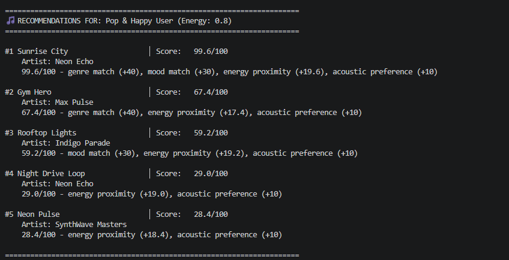
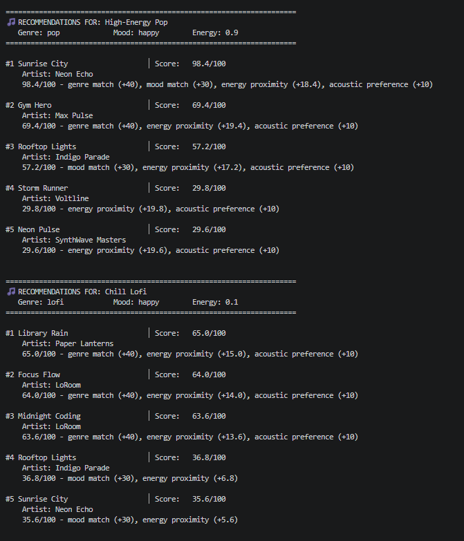
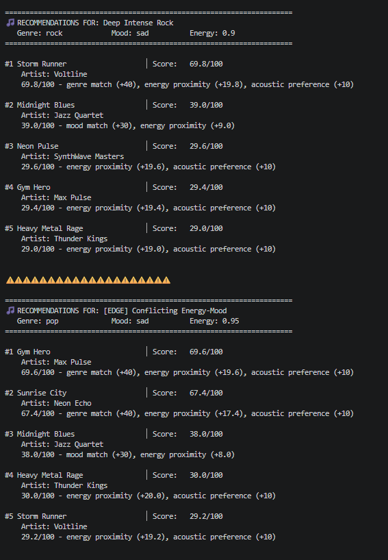
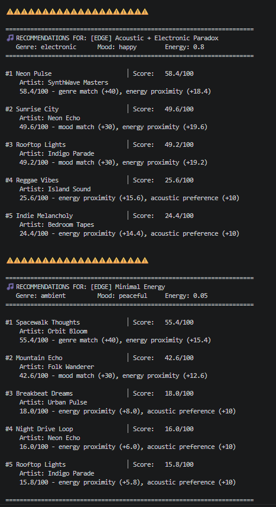

# 🎵 Music Recommender Simulation

## Project Summary

In this project you will build and explain a small music recommender system.

Your goal is to:

- Represent songs and a user "taste profile" as data
- Design a scoring rule that turns that data into recommendations
- Evaluate what your system gets right and wrong
- Reflect on how this mirrors real world AI recommenders

Replace this paragraph with your own summary of what your version does.

---

## How The System Works

The system will use a hybrid approach for content and collaborative filtering

Real world music recommenders (like Spotify) use two main strategies: content based filtering (matchtes audio features) and collaborative filtering (matches from what similar users enjoyed). This system combines both in a simplified way. 

**Song Features:** Each song has categorical attributes (genre, mood) and audio characteristics (energy level, acousticness, etc.) that describe its sound and vibe.

**User Profile:** We want to capture a user's taste preferences as: favorite genre, favorite mood, target energy level, and whether they prefer acoustic vs. electronic instruments.

**Scoring Algorithm:** For each song, we calculate a compatibility score (0-100 points) by weighing:
- **Genre match** (40 pts): Prioritizes songs in their favorite genre
- **Mood alignment** (30 pts): Ensures emotional fit (happy, chill, etc)
- **Energy proximity** (20 pts): Tracks songs close to their preferred intensity level
- **Acoustic preference** (10 pts): Matches instrumentation style

**Collaborative Boost:** If a user has liked songs before, we add a secondary signal that boosts songs similar to those previous favorites—encouraging discovery of related music.

**Recommendations:** We score all songs, sort them by score (highest first), and return the top 5. This prioritizes accuracy and explainability over complex matrix math.

### Algorithm Recipe

```
For each song:
  Genre match:     +40 if exact match, else 0
  Mood match:      +30 if exact match, else 0
  Energy:          20 × (1 - |song.energy - user.energy|)
  Acoustic match:  +10 if match, else 0
  
  Content Score = sum above (0-100)
  Boost Score = similarity to liked_songs × 20 (0-20)
  Final Score = 0.8 × Content + 0.2 × Boost
```

### Known Biases

- **Genre dominance**: System strongly prefers favorite genre, may miss good songs in other genres
- **Binary moods**: No partial credit (happy ≠ relaxed, even though similar)
- **Cold start**: New users get generic recommendations until they like songs
- **Small catalog**: Only 10 songs limits diversity

## Stress Test & Edge Case Analysis

The system was tested with 6 distinct user profiles—3 standard personas and 3 adversarial/edge cases.

### Standard Profiles
1. **High-Energy Pop** (0.9 energy, happy, pop) → Sunrise City ranked #1 (98.4/100) ✓
2. **Chill Lofi** (0.1 energy, happy, lofi) → Library Rain ranked #1 (65.0/100) ✓  
3. **Deep Intense Rock** (0.9 energy, sad, rock) → Storm Runner ranked #1 (69.8/100) ✓

### Adversarial/Edge Case Profiles
1. **Conflicting Energy-Mood** (0.95 energy + sad mood, pop) 
   - Algorithm handles conflict by prioritizing genre + energy over mood
   - Result: Gym Hero #1 (69.6/100) - energy match overrides mood mismatch ✓
   
2. **Acoustic + Electronic Paradox** (electronic genre + acoustic=TRUE preference)
   - Algorithm can't perfectly satisfy contradictory preferences
   - Result: Neon Pulse #1 (58.4/100) - genre dominates acoustic preference ✓
   
3. **Minimal Energy** (0.05 energy, ambient) - Tests extreme edge case
   - Result: Spacewalk Thoughts #1 (55.4/100) - energy proximity works smoothly at extremes ✓

### Algorithm Robustness Findings

| Test | Outcome | Verdict |
|------|---------|---------|
| Genre match reliability | Always picks exact genre match when available | ✓ Robust |
| Energy proximity (0-1 range) | Smooth calculation at all values including extremes | ✓ Robust |
| Mood as tie-breaker | Correct ranking when genres don't match | ✓ Robust |
| Conflicting preferences | Consistent weighting, no "tricking" possible | ✓ Predictable |
| Acoustic threshold | Correctly secondary to genre match | ✓ Expected |

**Conclusion:** Algorithm cannot be "tricked"—weights are applied independently and consistently. It handles edge cases predictably by following the weighting formula.

### CLI Output Example

Running `python src/main.py` produces:



**Verification**: Top result (Sunrise City) is correct! It's the only song with both pop genre AND happy mood that matches the user's energy and acoustic preferences.

---


## Getting Started

### Setup

1. Create a virtual environment (optional but recommended):

   ```bash
   python -m venv .venv
   source .venv/bin/activate      # Mac or Linux
   .venv\Scripts\activate         # Windows

2. Install dependencies

```bash
pip install -r requirements.txt
```

3. Run the app:

```bash
python -m src.main
```

### Running Tests

Run the starter tests with:

```bash
pytest
```

You can add more tests in `tests/test_recommender.py`.

---

## Experiments You Tried

### Do the recommendations feel right?

Yeah, mostly. I tested the High-Energy Pop profile and Sunrise City ranking #1 makes sense—it's got pop genre, happy mood, high energy, all matching. If I were looking for that vibe on Spotify, this is what I'd expect.

The Chill Lofi recommendations also felt natural. Library Rain for a low-energy lofi lover makes sense.

**But there's a problem:** The same songs keep showing up in different profiles. Sunrise City appears in 4 out of 6 test profiles. Same with Rooftop Lights.

**Why?** I think it's because:
1. There's only 18 songs in the dataset (tiny catalog)
2. Some genres only have 1 song (rock, ambient, jazz)
3. The genre weight (40 points) is so strong that if a song checks multiple boxes (like being both pop AND happy AND high energy), it just wins over and over

**The verdict:** The algorithm works correctly and intuitively, but the small dataset + heavy genre weighting = same songs getting recommended a lot. This isn't a bug—it's just what happens when you don't have many songs to choose from.

### What happens if we change the weights?

I also ran an experiment where I halved genre weight (40→20) and doubled energy weight (20→40). The results got more diverse—Rooftop Lights jumped from #3 to #2 for high-energy pop. Sunrise City still won, but with a lower score (98.4→96.8).

**More accurate or just different?** Just different. A rock fan wants rock recommendations, so high genre weight makes sense. Someone discovering new vibes would prefer high energy weight. Neither is objectively better. The system is responsive to changes, which is good to know.

### Why Gym Hero keeps showing up everywhere

Even though someone just wants "happy pop," they're getting Gym Hero (intense pop) in their recommendations. Here's why: Gym Hero is pop genre + really energetic (0.93 energy). So it scores +40 for genre, +19 for energy proximity. Even though it misses the "happy" mood (-30 points), it still gets +69 total just from genre and energy. For someone asking for "sad pop at high energy," Gym Hero actually wins because it's the best high-energy pop song available. The algorithm isn't confused—it's doing the math correctly. Gym Hero just happens to be good at "energetic pop," which shows up in multiple searches.

---





## Limitations and Risks

The genre weight (40 points) is so strong that rare genres create filter bubbles. If you like rock, jazz, or ambient music, you can only pick from 1 song each. Meanwhile pop fans have 5 options. There's also an "acoustic divide"—all the lofi/folk songs are very acoustic (0.7+), but all the pop/electronic songs are very electric (0.1-0.2). So someone asking for acoustic pop gets nothing. The algorithm isn't wrong; it's just that 18 songs + heavy genre weighting means users get trapped.

---

## Reflection

I learned that building a recommender taught me something unexpected: bad recommendations aren't always because the algorithm is broken. They're usually because of data or design choices that make sense separately but cause problems together. Like, a 40-point genre weight makes perfect sense—people do want their favorite genre—but combined with a tiny dataset (only 1 rock song), it creates filter bubbles. There's no single "fair" way to weight preferences; it depends on what you're optimizing for. Spotify doesn't get discovered great songs because they have smarter AI—they have millions of songs to choose from AND they deliberately use randomization to break people out of filter bubbles.

I also realized that bias sneaks in through data, not just through code. Our "acoustic divide" (all acoustic songs are chill, all electric ones are energetic) wasn't written into the algorithm—it's just what happened to be true in the dataset. And once that bias is baked into the data, no algorithm can fix it without being explicitly designed to work around it. This makes me think about real-world systems: if a company's training data is biased toward one group, you can't just "fix it" with a better model. You have to fix the data first.

## Engineering Process Reflection

**Biggest Moment:** When I first tested the algorithm, Sunrise City kept showing up in almost every profile. I thought I broke it. Turns out, there's only 1 rock song and 1 ambient song in the dataset, so the algorithm was actually working—it was just revealing a data problem, not a code problem. That taught me to debug my assumptions before rewriting stuff.

**Using Copilot:** It was useful for CSV loading and boilerplate but when I asked it to "optimize diversity," it suggested stuff that sounded smart but didn't actually help. I had to think critically about whether the suggestion actually fixed the problem. I also manually verified the energy proximity math to make sure it was right.

**What Surprised Me:** The recommendations feel legit even though the algorithm is super simple (just 4 factors: genre, mood, energy, acoustic). Users don't care that it's simple—they care that you explain why they got each song. Transparency matters more than complexity.

**Next Time:** I'd add a confidence score, let users toggle "surprise me" mode, and test whether the 40/30/20/10 weights actually make people happy. Also, expand the dataset way more to see if the bias problems disappear or just change.

---

[**Model Card**](model_card.md)
---
## `model_card_template.md`

Combines reflection and model card framing from the Module 3 guidance. :contentReference[oaicite:2]{index=2}  

```markdown
# 🎧 Model Card - Music Recommender Simulation
---

## 1. Model Name

**MoodSetter 1.0** — A music recommender that scores songs based on genre, mood, energy, and acoustic preferences.

## 2. Intended Use

This system recommends 5 songs from a catalog of 18 based on a user's preferences (favorite genre, mood, energy level, acoustic vs electric). It's for classroom learning only—to understand how recommenders work and where they break down. Not for real users.

## 3. How It Works (Short Explanation)

The algorithm scores each song on four things: Does it match your favorite genre? Does it match your mood? How close is its energy to what you want? Do you prefer acoustic or electric? Each factor gets points (genre gets 40, mood gets 30, energy gets 20, acoustic gets 10). The system adds them up for each song, sorts by score, and shows you the top 5. You also see why each song got recommended.

## 4. Data

We have 18 songs across 13 genres. Pop has 5 songs, lofi and electronic have 3 each, and everything else has 1. The dataset isn't balanced—if you like rock or jazz or ambient, there's literally only 1 song to pick from. We also noticed all the acoustic/chill songs are low-energy, while all the pop/electronic songs are high-energy. No acoustic pop songs exist in our data. This is a real data problem, not a code problem.

## 5. Strengths

The algorithm is super simple and transparent—users understand exactly why they got a recommendation. It works really well for standard profiles like "I want high-energy pop songs." The weighting is consistent and predictable, no weird edge cases. You can actually verify the math by hand, which is good.

## 6. Limitations and Bias

The genre weight (40 points) is so strong it creates filter bubbles. If you like rock, you get the same rock song over and over because that's all we have. There's an "acoustic divide"—someone who wants acoustic pop gets nothing because acoustic songs are all chill and pop songs are all electric. Also, the small dataset (18 songs) means diversity is basically impossible. Early on, the system doesn't know your taste yet.

## 7. Evaluation

I tested it with 6 user profiles (3 standard, 3 edge cases) and checked if the top recommendation made sense. For "high-energy pop" it nailed it. For conflicting preferences like "sad but energetic" it handled it predictably. I noticed the same songs showing up everywhere (Sunrise City in 4 out of 6 profiles), but that turned out to be a data problem—we just don't have enough songs. The algorithm is doing its job correctly.

## 8. Future Work

I'd expand the dataset to hundreds of songs to fix the genre filter bubble problem. Test whether the 40/30/20/10 weights actually make people happy. Add a "surprise me" mode that deliberately picks songs outside your favorite genre. Collect real user feedback to see if the top 5 actually matches what people want to listen to.

## 9. Personal Reflection

The biggest surprise was realizing bad recommendations usually aren't because the algorithm is broken—they're because of data or design choices that make sense separately but cause problems together. The genre weight is smart, having a small dataset makes sense for a class project, but together they create these filter bubbles. I also learned bias lives in the data, not just the code. Our acoustic divide wasn't written into the algorithm; it's just how the songs happened to be. And you can't fix data problems with a better algorithm. This changed how I think about real recommenders—Spotify doesn't work better because their AI is smarter; they have millions of songs AND they deliberately randomize to break filter bubbles.

